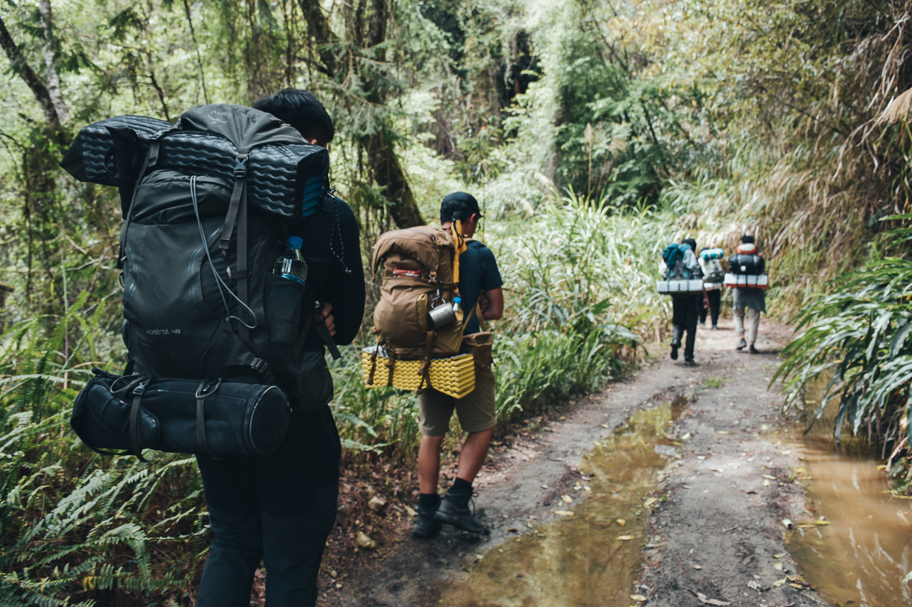

2021 年有非常多的轉變與抉擇，是讓自己很深刻的一年，雖然年初有一些個人因素，影響後續許多計畫與安排，但之後從個人職涯選擇以及決定，為自己嘗試更多各種不同的挑戰，雖然過程很不容易，但能能充實的過完這一年。

## 2021 回顧

- 協助前公司部分產品 Containerized 建置與Kuberentes - IT 初期工作流程基礎規劃，學習很多寶貴的維運經驗。
- 下半年決定為自己職涯嘗試新的挑戰，轉換職務，雖然過程花很多時間為認知與技能做轉換，過程參與事件活動非常多，但忙得有意義，非常充實。
- 在 [COSCUP 2021](https://coscup.org/2021/zh-TW/session/9X7UAG) 協助 CNTUG 社群議程軌-開源運河上的雲原生號擔任主持人：首次 COSCUP 線上虛擬舉行，體會主持人如何引導議程進行時，與講者會眾互動 Q&A ，並完成整個整個議程軌活動，難得且充實的年會體驗。
- 擔任 [HPC Summit 2021](https://www.garaotus.com/HPC2021/vod/) 講者：有機會分享抽空研究DeepOps 的專案，如何對於 AI/ML Infra 建置的部署工具與企業場景實際應用分析([簡報連結](https://speakerdeck.com/yylin1/deepops-an-efficient-way-to-deploy-gpu-cluster-for-computing))。
- 擔任 [Kuberentes Summit 2021 - WorkShop](https://k8s.ithome.com.tw/lab-page/553) 講者: 學習如何用會眾角度規劃整個工作坊設計。
- 回歸山岳攝影-登山健行: 持續撰寫[登山系列文章](https://medium.com/yiyang-lins-life)，跟一群好友組了登山興趣小組，開始嘗試(台灣中級山系列、台北大縱走路線完成4/7段[持續進行中])，脫離城市的大自然體驗。
- 自己動手做一顆手工肥皂，感謝 [SU VIDA x 私 生活](https://www.instagram.com/suvida_tw/) 開設的工作坊
- 攀岩(抱石) 維持 LV2 等級都順利完攀，持續往下一級前進。
- 終於換了新一台相機 Sony A7 IV 

## 2022 展望
- 增強專業能力部分，提升各方面不足點
- 花更多時間在技術文章撰寫
- 完成先前未完成的證照
- 回歸開源專案貢獻，積極參與 Conference / Meetup 分享
- 持續健身運動維持飲食控制，為百岳做後續準備

### Related Posts
- [2020-年度回顧 (舊 Blog 搬家中)](https://www.yylin.io/2020/12/31/2020-retrospect-prospect/)

> 2022 繼續爬山

- Photography Blog (https://medium.com/yiyang-lins-life)

