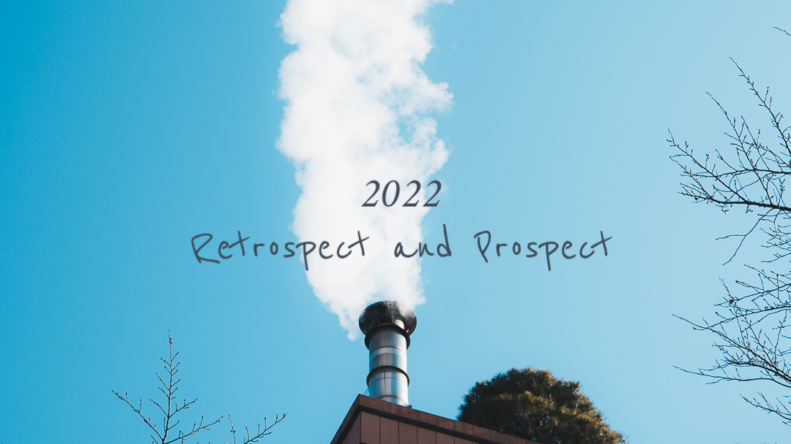

2022 年有非常多的時間進行選擇與尋找定位，雖然過程很不容易，但今年還是很充實的過完這一年，很多朋友開始在年底都會有復盤自己的習慣，想過好下一年，那麼知道今年你是怎麼過的？或許對自己會有很大的幫助。本篇是個人於 2022 年的記錄以及對於未來的展望。

##### 2022 年回顧

- 轉職 `SSA(Specialist Solution Architect/領域專家解決方案架構師)`滿一年多了，雖然花很多時間與團隊在對於角色定位與支援上安排，主要和 SA 關注在不同的面向，更重於在解決方案中針對某一領域的問題提出相對應的系統架構。舉例來說更重於思考實際客戶系統架構需求或系統設計面，並和售後團隊有更密切接觸。
- 疫情開放後，參與入職來首次公司舉辦的 `Outing` 活動，讓售前/售後團隊，能有更進一步的團隊對話與技術互動。
- 嘗試考 `AWS Solution Architect Associate (SAA-C03)`剛好報名前題庫改版，補好多不同的題目，閱讀考古題比較沒有新的題庫，可惜最終分數差 3題只好明年再來重考(很想拿到)，年底公司指標只好直接趕緊補考 `AWS Certified Cloud Practitioner (CLF-C01)`裸考意外簡單很多。
- 開始維護公司 `AAP POC` 專案重拾之前合作送 `PR (Pull Request)`的狀態，希望能持續加更多 Demo 應用場景幫助團隊。
- 成為薩提爾教練模式 Satir Coaching Model 的『夥伴』，並針對同一個議題進行 2 次對話，透過練習過程，像是跟一面鏡子進行自我對話的方法，期待後續的主題，感謝 COSCUP 認識的夥伴邀約。
- 完成每季定期 3 篇 `Blog` 希望能繼續保持，讓自己每個階段都有收斂與查閱資訊的地方。    
- 疫情開放，和夥伴快速安排出國「首爾」攝影紀實之後在補充一篇文章。
- 記得 2022 年初趁著夥伴對於 `中級山`、`縱走山行`心情還溫熱，大夥討論來訂下 2022 年度指標清單挑戰之一「嘉明湖」，最後一起報名 `台灣 368 商業團` 和夥伴們一起走過並多拿下兩座百岳，我的 ⛰5th #向陽山 3,603m, ⛰6th #三叉山 3,496m。
- 挑戰成功「[臺北大縱走尋寶石任務]((https://taipeigrandtrail.travel.taipei/))」七段任務，最終和兩位夥伴一起完成所有縱走，感謝從 2021-2022 一起假日遠離都市來健行的夥伴們!
- 個人興趣培養與成長，持續更精進自我攝影觀念與技巧，這次不拍山岳風景社攝影，來參加 [@4samatha](https://www.instagram.com/4samantha) 舉辦的`人像工作坊`和與 [@jerrythepopper](https://www.instagram.com/jerrythepopper/) 兩位攝影師交流，從人像實戰體驗培養美感的方式，並記住自己要多嘗試一點減法攝影，期待明年有更多不一樣的作品。
- 自我盤整之外，嘗試今年做了一部攝影 72 張照片回顧，透過鏡頭記錄自己的每一刻，感謝夥伴[紙片模型](https://www.youtube.com/channel/UCI2WLm8J8y_Upm0dVdGZFQg/videos)一同協助。

##### 2023 年展望

- 希望英文交流能變更好，疫情趨緩會有更多跨國年會與工作上同事交流，參加團隊聚會時希望能跟他們說一些日常交流
- 安排每週固定去健身房，轉換職涯後都沒繼續
- 投稿**社群技術**演講 2 場 
- 完成先前未完成的 Red Hat 證照
- 攝影/紀實部落格能有效經營，建立好 IG 專頁，出國機會更多，需要工作流程讓照片穩定輸出

### Photography | 2022 Recap



### Related Posts

- Photography Blog (https://medium.com/yiyang-lins-life)

