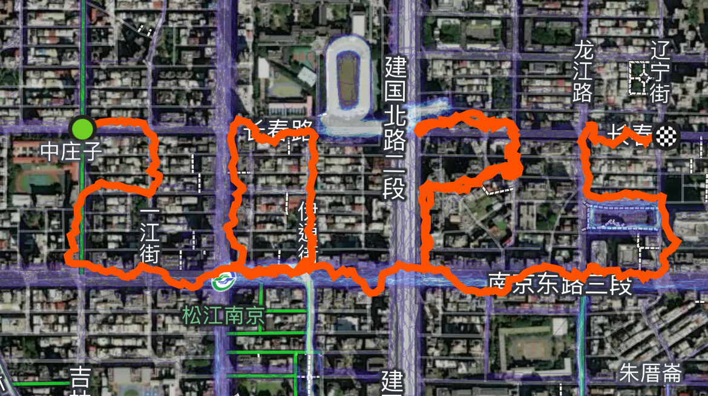
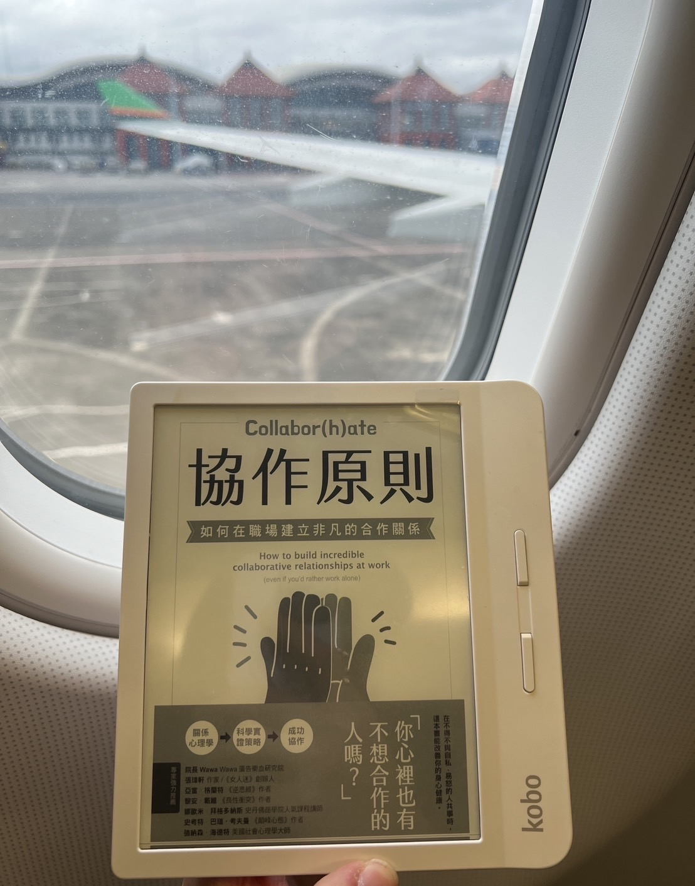

今年是我再次轉換跑道的一年，雖然照著既定計畫前進，但也嘗試了一些未曾計畫的新事物，並培養了新的興趣。在工作環境的氛圍上，我面對了一個截然不同的挑戰，過去的職涯成果和經驗，讓我能夠堆疊出即戰力，同時也不斷進行調整和嘗試。今年是我回顧年度目標與成果的第 6 年，這一年有許多新波動與起伏，儘管如此，我很高興能在這個過程中找到自己持續成長的新起點。

## 一、今年有哪些事情很好？

根據今年 2024 年訂定的新年目標，我在兩個方面的完成度表現不錯，分別是「**持續閱讀習慣**」和「**重拾攝影熱誠與建立個人品牌**」。每週末，我都會留出時間給自己閱讀，並持續累積讀書清單。透過這段時間，我也發現自己選書和關注的領域逐漸有所轉變。今年閱讀 40 本書，文章後段會分享自己認為值得推薦的書籍。總體來看，以下三個領域是我具體表現最好的部分：

### 1. 挖掘天賦與熱情，追求職涯方向

在職涯初期就在思考自己的規劃，我知道初入職場的新鮮人都是很願意嘗試不同角色與定位，但是我不會脫離自己預期的職位工作定位，那時候接觸到[【人文講堂】為什麼我們對職涯如此焦慮 - 姚詩豪的演講影片](https://www.youtube.com/watch?v=7c2mHGC7Sv0)，讓我有一個習慣自己會在職涯歷程每隔 2 年都會重新讓思考自己在這個階段的關卡，我累積多少新的「**關鍵字**」、我為這家公司貢獻了什麼樣的成果的大小里程碑，如在影片結尾有總結「我們不只是為了工作而工作，而是應該把自己當成品牌來經營，社會新鮮人再踏入職場後的前 5 年，真的是探索興趣及培養專長的準備階段，**找到自己人生的主導權**」。回頭想當初對於「追求什麼樣的工作」，我一直很有意識地思考，並且更看重自己是否能夠真正投入並對工作充滿「熱情」(Passion)。更重要的是，我希望在當前的職務和「職場舞台」中，透過執行各項任務，發現哪些工作能讓我常常進入心流狀態。背後更深層的期待，是能夠累積長期的成就感與收穫，而這與單純的金錢回報相比，具有更大的差異。我多年也持續為自己建立「職涯進度追蹤表」，以便更清晰地檢視自己的成長與進步。

回想自己第一份工作離職時老闆送過我一句話，不管到哪個工作環境，都要持續思考「工作的樣貌」是不是能有給你「持續燃燒熱情的舞台」，很慶幸在往這個目標邁進的路上雖然有非常多選擇與變化，但我們的選擇，往往決定了個人成長曲線，也讓自己嘗試了未曾計畫的各種事物。所以那時候我不斷會思考，限於短期內的安穩，可能會換來長期的停滯；而我一直都很願意承受不確定性，希望能為自己爭取不同的成長空間並找到自己想要能持續增長的軌道上。

2024年選擇再次轉換新的跑道，也在這份工作中，找到自己天賦還有能持續點燃自己「熱情」的火種，回頭思考前一年，從梳理手邊的工作，探索「自己下下一步」想要的是什麼與影響自己的那些專案工作，那時我意識到我再次接觸到「真正進入心流的狀態與興趣熱情」的任務，原來自己原本研究領域才是真正該去追求的職涯方向。在這之前我其實堅持很久，希望讓自己隨時 **well-prepared** 當機會降臨時，才有能力抓住，每一段經歷都為了成就更好的你，而每一個工作與經歷都是給予成長的養分。

這裡分享一本我很推薦的書——《協作原則》，主要探討如何在職場建立非凡的合作關係。書中有個章節標題很有趣：「什麼時候該下車」。其中提到一個總結：「穩定性＝成果－你認定可以在其他地方得到的好處」。這提醒了我們，職涯其實充滿選擇，而關鍵在於如何做出對未來有價值的決策。我常用的一個方法，幫助我在做選擇時更有方向：

｜ 想像自己已經做了這個選擇，時間來到 2 年後，再問自己： 這個選擇帶來的好處，是否仍然重要？ 如果當時選了另一條路，現在的自己會不會後悔？把這些可能想過的事情都思考列出來，或許是能讓你對自己的職涯規劃有更多的啟發！

另外從 [思維槓桿 - S4E16 創造心理安全感的重要性](https://youtu.be/OUsUl1V1zLw?si=IOqvgAFQMljmVtQp)2024中的這集也體悟很多，我深刻感受與體會「**職場環境的重要性**」，若能在職場或日常生活中建立一個讓人安心發聲、敢於嘗試錯誤的環境，讓團隊更高效、個人更有動力，打造真正具備信任感的關係與文化，能創造的喜悅越多，身邊的同事也是不斷增長成為新版本的樣子，企業需要建立的就是這樣擁有安全感能讓員工持續在未來茁壯成長的氛圍。

### 2. 重拾攝影初衷，讓影像成為一場旅程 —— YANG VISIONS

攝影，對我而言從來不只是按下快門的瞬間，而是一次透過鏡頭與世界對話的方式。

近 10 年來，我專注於風景、城市與展覽攝影，透過鏡頭探索世界，捕捉每段旅程的獨特故事，也用影像記錄生命中的片刻。攝影不僅讓我看見城市的變遷，也讓我在光影與構圖之間，體驗瞬間與永恆的交錯。然而，在不斷拍攝與追求技術突破的過程中，我開始思考：
- 最初讓我愛上攝影的原因是什麼？ 
- 這些影像，是否該好好整理，讓它們講述更完整的故事？

今年，我開始系統化整理過去的作品，回顧這些年來的拍攝歷程。我發現，攝影對我而言，從來不只是記錄，而是一種故事的堆疊與視覺敘事。我想做的不只是拍攝更多畫面，而是讓影像彼此串聯，形成有溫度、有情感的故事，讓觀看的人感受到其中的氛圍，甚至喚起自己的記憶與情感共鳴。或許你熱愛旅行，而我的視角，能讓你彷彿成為同行的夥伴，透過照片重新體驗那些未曾親歷的瞬間。

這份對影像敘事的渴望，讓我萌生了一個念頭：為自己策展，打造專屬的攝影品牌。這不僅是對多年創作的整理與回顧，也源於身邊朋友的鼓勵——讓攝影不只是存放在硬碟或社群媒體，而是真正「被看見」，成為能與觀者對話的作品。2025 期待自己的攝影展間!

### 3. 個人生活

最開心的今年完成人生新挑戰「初馬- 臺北馬拉松/ Taipei Marathon」，我相信只有充分的準備「堅持」下續，每週每天還是維持平常的訓練距離，才能平穩順利完成初馬(也同時完成和同事一起跑馬拉松)的里程碑。在 2024 年培養新的興趣「跑步」，當初會開始跑步是和朋友設定「玉山主峰單攻往返計畫」，後來太久沒百岳也要背負重裝攝影器材單攻，可能會是很艱難的挑戰，我就和朋友揪下加入「MAC - Montréal Athletes Club」，發現跑步過程是很歡樂也是輕鬆的，也因為有這個過程，讓初次對跑步這項運動不太能適應的我，感受到跑步的熱血與社群的力量，每次跑步還能有跑友自發性捕捉彼此的照片可以拿(上過社群IG 封面)。有社群推力讓我從每日忙碌工作過程中，更有動力與意識的去跑每週的一的活動，跑步真的能短暫放下複雜的思緒，將狀態投入在腳踏的每一步路上，讓跑步快樂來源還有事和跑步的朋友們一揪跑步，創造那些激勵人心、充滿能量的瞬間，後來也和朋友透過社群方式經營另外「跑 GPS圖的計畫，在今年最後一刻還完成迎接「2025年」的GPS地圖，讓我很期待未來跑馬拉松新目標與新挑戰！

## 二、今年有哪些事情不太好？

回顧今年的目標裡面，「透過社群力量撰寫新書」算是完全沒有進展。原因是當我思考了很久之後，決定在年初的時候暫緩這項計畫，而改將專注力全部放在 YouTube 影音內容的製作以及線上課程的籌備。所以這目標與其說是目標，倒不如說是在一開始就胎死腹中的妄想。只是這件事情，對於現在的我來說又產生了新的靈感，待會在規劃新年目標的時候我會再次提及。

接下來，就是我透過回顧之後，發現有三件做得不夠好的事情，以及我馬上採取的改善行動（今年我提早在 12 月初就開始做年度回顧和採取改善行動了）。

### １. 中止了訂閱制的贊助

### 2. 我面對演講的時候不是完全開心

### 3. 我今年使用電腦的習慣糟糕透了

## 三、我從中學到了什麼？ (三個關鍵字，聚焦在有價值的事上)

| 關鍵字一 : #共友
- 擷取朋友就是「共友」，共同點越多關係越深入！

| 關鍵字二：＃餘裕

擁有同時兼顧「成果」和「餘裕」的工作方式

大前提是取得「成果」，關鍵也在於「成果」

可自由支配的時間。如果有足夠的時間，心情上就能游刃有餘。正因為有這樣的餘裕，才能專注於能夠帶來成果的工作。

| 關鍵字三：＃舞台創造者

- 將「依賴他人」的想法轉為「活用人才」的想法，該怎麼樣提升自己的懈逅運？老實請求該領域的專家們「請教教我」！ 特定領域中能力高強的人，其實在等待自己出場的機會。
- 明確掌握自己不擅長的領域，接著把該領域的強者夥伴擺在你身邊，人脈關係圖 (人脈重要性)，能更明確離解自己遇到困難時該找誰商量
- 優秀的人是，特別善用人，表面上看起來他在依賴別人，事實上他正在「活用人才」，這類型的人又被稱作「#舞台創造者」

### 1. 有什麼問題重複出現？我明年該如何避免？

### 2. 活出一種生活風格，而不是企圖得到一座獎盃

### 3. 如果不訂出優先序，各種雜事就會填滿你

## 四、在新的一年活得像個贏家，看起來是什麼樣子？

# 五、值得閱讀的書

閱讀思維：順著接受出現在面前的知識，理解、分解，然後再構築

1. 《協作原則：如何在職場建立非凡的合作關係》- 讓我清楚知道一件事「協作對象不該一事同仁」，如果你不清楚自己屬於哪一種類型的，書中提供了一些問題可以幫助你評估自己和他人的協作風格及需求，從而提高協作的效率和滿意度。你也可以更清楚如何適應不同的協作對象、如何在協作中表達自己的期望和需求。另外我覺得描述最清楚的一章節「什麼時候該下車」：當你知道離開的路在哪裡的時候，書中透過關係數學「工程式」來讓讀者探索當前工作成果與幸福感，這也是我們有知道 Job 跟 Career 是不同的。Job 是一份為了生活而糊口的工作，而 Career 指的是個人不同的志業和選擇，是依據個人與生俱來的特質而建構的。所以書中的總結「穩定性=成果-你認定看在其他地方得到的好處」，或許遠處可能會有更大的舞台供你探索，書中有更多的案例或許能幫你思考這些問題的答案。https://vocus.cc/article/65aa8700fd89780001834d58

2. 《找到人生中最重要的7個人》 - 書中能讓自己回頭檢視自己，當前自己人脈建立與交友狀況，我們與誰同行，很大程度上決定了你可能成為怎麼樣的一個人，當初聽《耳邊說書》 Podcast [1] 感觸很深馬上下單閱讀這本書，另外開頭也提到美國知名企業家Jim Rohn 曾經說過一句名言：「你是與你相處時間最長的五個人的平均值」，你現階段相處的五個人平均成了你現階段的你，這五個人可能是你的朋友、家人、同事、伴侶。讓我更釐清朋友圈影響很大，長期關係的建立很重要但不容易，從我們選擇什麼樣的工作，選擇什麼樣的生活模式思考後原來我是這樣的個體這樣的自己。(閱讀完書後，很認真的參考文章也為自己畫了一個心智圖）[1] 延伸文章：人脈養成術！《找到人生中最重要的7個人》 - PressPlay

3. 《30有成：如何成為自在、富有、不後悔的大人》 - 人生有很多課題需要「選擇」真的是一件很難的事，介紹很多人生、職場、人際關係等之間的各種選擇的思維方向，提到每個人若可以常把人生後續的機會最大化，有更多餘裕牌局會越來越好，也會有更多的選擇不會只有單選題，我更多體悟是，每個選擇要都是有意義的，更多的時候是要相信自己的「選擇」。

4. 《療癒，從感受情緒開始》 - 會推薦這本書中有談到，人是變動的，不同階段有不同的渴望，更重要的不是對方是誰，而是你需要什麼。和我看過大人學一篇文章，很有共鳴剛好很貼近這本書主體，這篇文章是「人生穩當的交友策略，不外乎就是親近「螞蟻」但遠離「蚱蜢」裡面談的概念很相近，「每個人的人生成就，除了跟能力和認知邊界有關，也跟「周圍都是什麼樣的人」息息相關」，實際選擇思考過後真的影響我很大。[2] 對情緒越想裝沒事，久了就越容易反噬｜《療癒，從感受情緒開始》｜文森說書

5. 《最佳狀態：超越心流，掌握個人持續卓越的情商》- 我常常輸給自己的過去觀點和死板的印象，透過這本書知道可以更深度有邏輯，讓自己更願意試著擴張邊界，用邏輯思考他人冰山以下的部分，去理解不理解的，用更寬廣的角度去看，不一樣不是唱反調，不一樣只是不一樣，但我們要如何應對與處理人和各種情境。

6. 《逆思維》《逆思維》讀後心得：顛覆常規、突破盲點的重新思考法

7. 《隱性潛能》

8. 《帶人的技術》

9. 《從我開始的關係功課》

10. 《原則：生活和工作》

## 五、我的新年計畫是什麼？

綜合今年的回顧，我對於明年的目標展望有兩個重點。

首先，**成為你想成為的人，而不是某個虛無飄渺的數字**。我原本想訂出一些新的數字（追蹤數、訂閱數、業績金額），但是經過這場回顧之後，我發現我一點也不在乎那些數字了（為什麼我要對我不能能控制的事情負責？）。更重要的，是我想成為什麼樣的人，閱讀前哨站要成為一個怎樣的網站，下一本讀什麼要成為一個怎樣的頻道。其他外在的數字，都只是別人對這種人、網站、頻道的信念的一種投票累積，是一種落後指標。我們能控制的，是成為什麼樣的自己，而這才是一種領先指標，也是唯一重要的事。

其次，**只做有長期效應的事情，不要急於短期的獎勵**。就像是我跟朋友最近聊到的，大家常問我明年的重心是什麼？我會說是「照顧自己」。更從容地閱讀更多的書，更詳實地撰寫更多的文章，更自律地維持運動習慣，更自在地安排前往世界各國的旅程。當我們照顧好自己，就可以更好地服務別人。當我們感激自己已經擁有的福分，就會更有餘裕思考如何幫助其他更多的人。

### 1. 只做優先順序內的事
如同前面列出來的優先順序清單，所有行程的安排都必須符合優先序（運動是第「零」優先，不需要列在上面）。額外製作一份「例外清單」，把任何跟優先序無關、但我終究還是做了的事情列上去，明年底再來回顧。

### 2. 只做有複利效應的事
簡單來說，每次的投入，都能在未來產生更大的收穫。寫書有複利效應，讀書有複利效應，做數位影音內容有複利效應，培養伴侶和家人的相處時間有複利效應。如果是一次性的事，錢要夠多，多到可以直接滾起金錢複利。

### 3. 只做慢但有成果的事

在過去的一年來，我嘗試了一些不同類型的合作，像是電視節目、訪談內容、線下講座…等，再加上前年的經驗，讓我終於歸納出「我喜歡、擅長、想要」的究竟是什麼。有些東西做起來慢，但是成果顯著；有些東西做起來快，但是成果低落。

最後，提醒自己經常思考：「**我在做的這件事情，是屬於能持續增值和開源的資產？還是會不斷耗損精力和資源的負債？**」多做資產，少做負債。所有圍繞著上述原則的事情，最後都會累積成明年底的目標。至於目標的數字要怎麼訂？那是留給時間去擔心的事，我們不需要操心。

創造之後可以讓我有更多時間的東西，而不是要我花費更多時間去擔憂的東西。讓自己保持在健康與精力的高檔，在最堅強的時候進行思考，而不是在脆弱的時候仰賴意志力。

期望在明年，當你來到一年的尾聲，你要的不是某個特定的結果，而是用一種全新的方式看待自己。

## 今年總結

2024年是一個 `重新` 的一年，因為 2023 年的分手低潮讓我意識到，我沒有辦法很好的處理 自己跟自己的關係 還有 自己跟別人的關係。所以今年花了很多時間認識自己，不管是透過『情緒覺察內在的需要』還是透過『星盤或人類圖了解自己的特性』，都幫助我更了解自己在什麼樣的狀態下是最舒服的，也比較不會再被別人影響。
在『穿越低潮後』有明顯感受到自己變得比較成熟一點點，希望自己可以持續保有這個『在挫折中成長的動力』